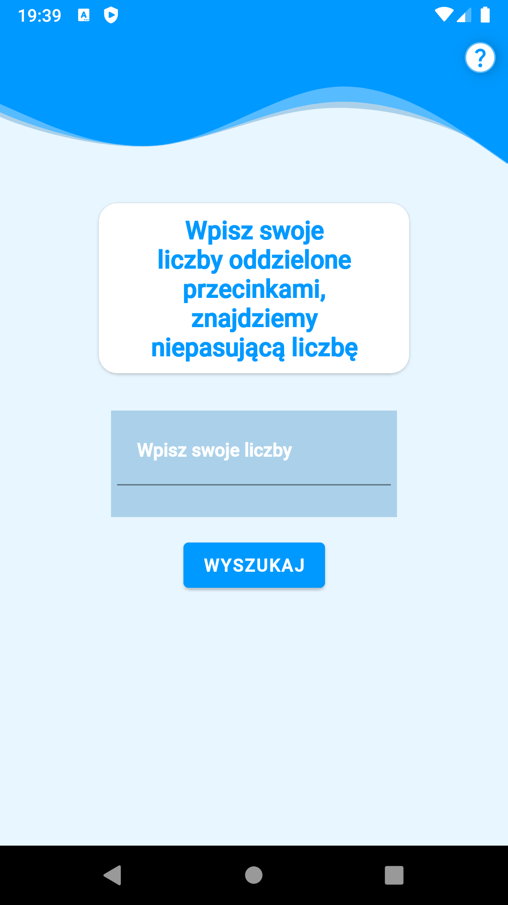
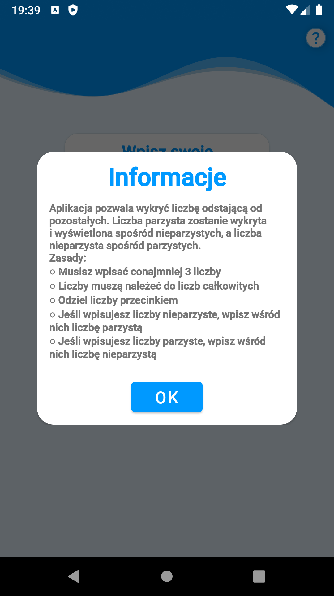
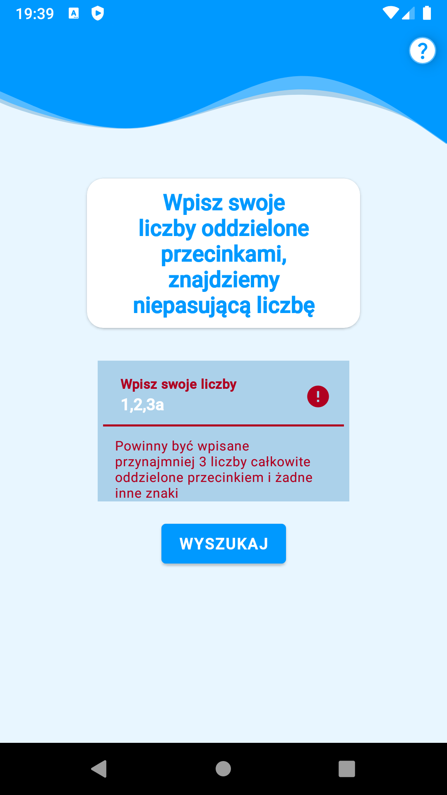
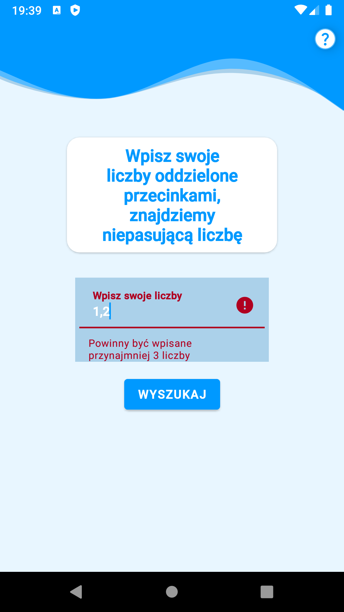
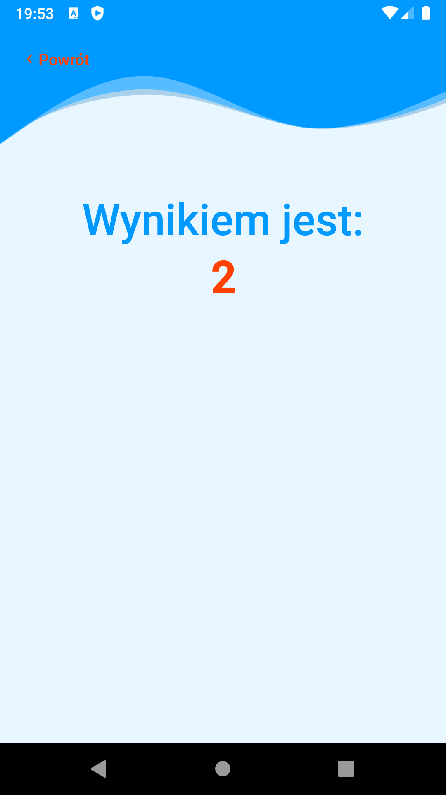

# BoredApp

PL:   
Aplikacja powstała jako projekt rekrutacyjny. Pozwala użytkownikowi na wpisywanie ciągu liczb całkowitych i wyszukanie liczby niepasującej do pozostałych. 
Jeśli ciąg zawierał liczby parzyste, znajdzie liczbę nieparzystą. Jeśli zawierał liczby nieparzyste, znajdzie liczbę parzystą. Dodałem również własny informacyjny Dialog Fragment. 
Aplikacja została napisana w architekurze MVVM przy użyciu dagger hilt jako wstrzykiwania zależności.

EN:    
The application was created as a recruitment project. Allows the user to enter a string of integers and find a number that does not match the rest. 
If the string contained even numbers, it will find an odd number. If it contained odd numbers, it will find an even number. 
I also added an informative custom Dialog Fragment. The application was written in MVVM architecture using Dagger hilt as dependency injection.

## Table of contents:
* [Technologies](#technologies)
* [Illustrations](#illustrations)

## Technologies
Project is created with:
* Kotlin
* Dagger Hilt
* Navigation Component 
* Coroutines
* View Binding

## Illustrations

 
 
 
 
 
 

